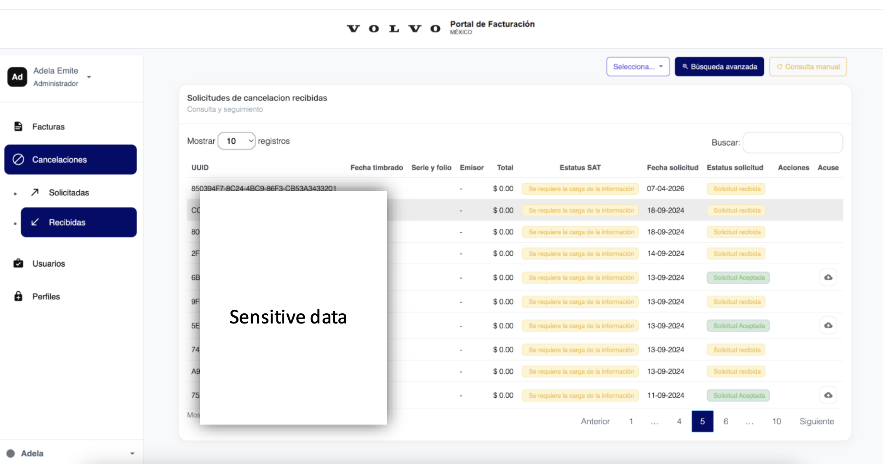
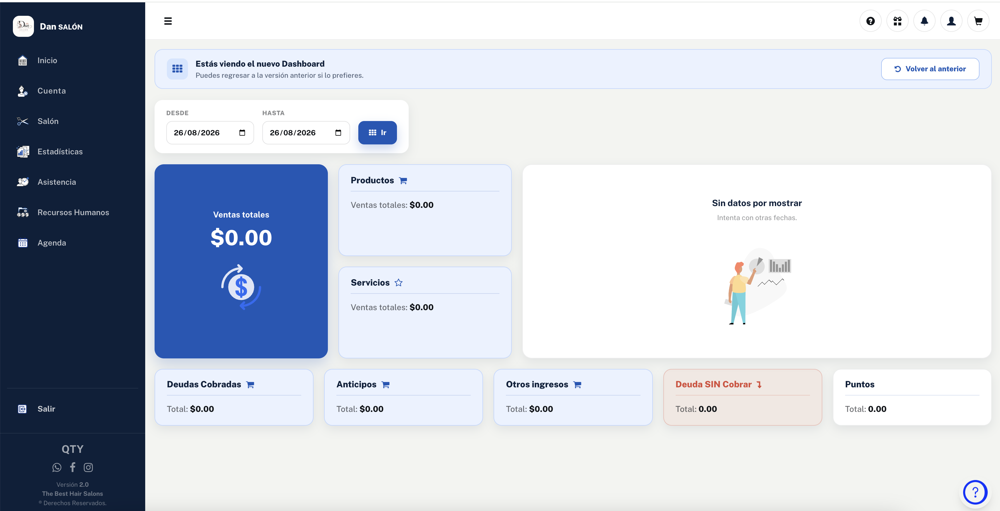
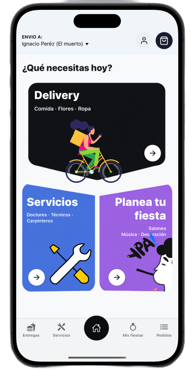
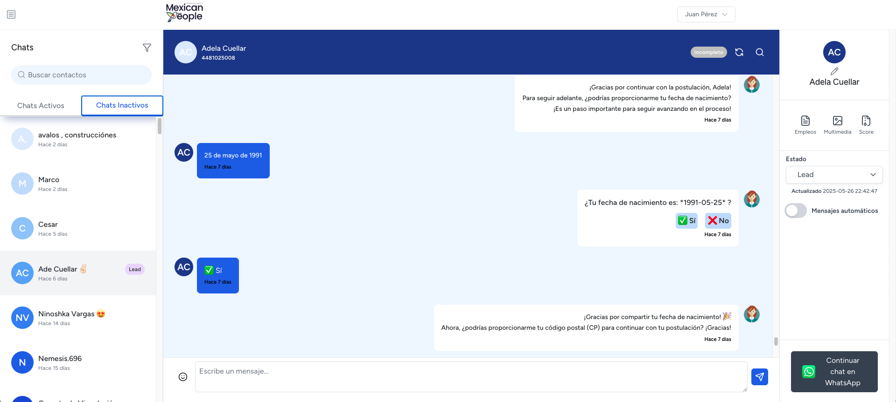
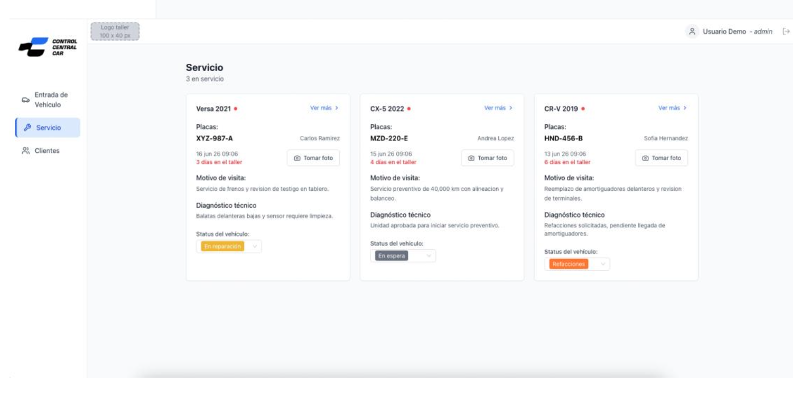
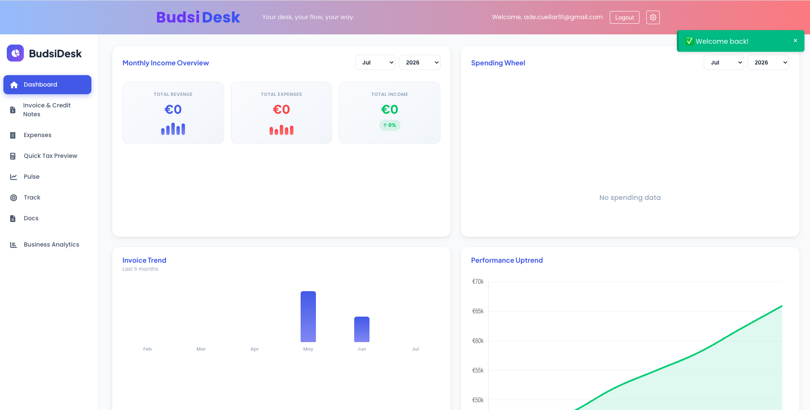

 

 

## 🚀 Sobre mí

> Full Stack Developer con más de 10 años de experiencia desarrollando aplicaciones web, móviles y plataformas de negocio. Diseño y construyo productos digitales de punta a punta: interfaces pulidas, arquitecturas sólidas e integraciones que escalan. Actualmente integro **IA (OpenAI, Claude Code)** para acelerar el desarrollo y optimizar procesos de negocio.

<table>
<tr>
<td width="50%" valign="top">

🔭 &nbsp;Trabajando en integraciones de IA y automatización de procesos con **n8n**
🌱 &nbsp;Explorando arquitecturas serverless y de datos con **AWS Lambda / DynamoDB**

</td>
<td width="50%" valign="top">

💬 &nbsp;Pregúntame sobre **PHP/CodeIgniter, React, Node.js, .NET o WordPress**
📍 &nbsp;Querétaro, México &nbsp;·&nbsp; 🗣️ Español (nativo) · Inglés (técnico)

</td>
</tr>
</table>

 

## 🛠️ Stack tecnológico

**Frontend**
 

**Backend**
 

**Bases de datos & Cloud**
 

**WordPress, IA & Automatización**
 

 

## 💼 Proyectos destacados

<table>
<tr>
<td width="50%">

**🚗 VOLVO — Plataforma de facturación**
 
Migración de CodeIgniter 3 a 4, gestión de facturación e integración con SAT.
 
`PHP` `CodeIgniter 4` `MySQL` `REST APIs`

</td>
<td width="50%">

**💇 [The Best Hair Salon](https://thebesthairsalons.mx/)**
 
Plataforma de reservas y gestión de negocio con chatbot de soporte con IA y reportes automatizados.
 
`PHP` `CodeIgniter` `React` `FullCalendar` `n8n`

</td>
</tr>
<tr>
<td width="50%">

**🌸 Piter**
 
App móvil de directorio de negocios con geolocalización, filtros avanzados e integración vía plugins personalizados de WordPress.
 
`React Native` `Firebase` `WordPress` `WooCommerce`

</td>
<td width="50%">

**🤖 Agente de Reclutamiento IA**
 
Chatbot conversacional conectado a OpenAI vía WhatsApp para automatizar procesos de reclutamiento.
 
`Laravel` `OpenAI API` `WhatsApp API` `AWS`

</td>
</tr>
<tr>
<td width="50%">

**🔧 Control Central Car**
 
Plataforma de gestión para talleres mecánicos: seguimiento de vehículos, diagnósticos y clientes.
 
`React` `React Native` `Supabase`

</td>
<td width="50%">

**📊 BudsiDesk**
 
Plataforma de gestión empresarial con facturación, gastos, roles y reportes financieros.
 
`Python` `Django` `PostgreSQL`

</td>
</tr>
</table>

📁 &nbsp;Ve el portafolio completo, con más proyectos frontend (Shopify, WordPress, experiencias interactivas) en&nbsp; **[adeev.com.mx/adecuellar](https://adeev.com.mx/adecuellar/)**

 

## 📈 Trayectoria profesional

<table>
<tr><td>🟣</td><td><b>Adeev</b> (Freelance) — Full Stack Developer</td><td align="right"><i>2016 – Presente</i></td></tr>
<tr><td>🔵</td><td><b>OCCMundial</b> — Full Stack Developer Senior</td><td align="right"><i>2023 – 2024</i></td></tr>
<tr><td>🟢</td><td><b>Nexta</b> — Senior Frontend Developer</td><td align="right"><i>2021 – 2023</i></td></tr>
<tr><td>🔵</td><td><b>OCCMundial</b> — Full Stack Developer</td><td align="right"><i>2018 – 2021</i></td></tr>
<tr><td>🟡</td><td><b>NCTech</b> — Web Developer</td><td align="right"><i>2016 – 2017</i></td></tr>
<tr><td>🟠</td><td><b>Innovation Workshop</b> — Web Developer</td><td align="right"><i>2015 – 2016</i></td></tr>
</table>

🎓 &nbsp;B.S. en Tecnologías de la Información y Comunicación — Instituto Tecnológico de San Juan del Río
🎓 &nbsp;Diplomado en Liderazgo Ejecutivo de Alto Impacto — Universidad Anáhuac

 

## 📊 GitHub stats

 

### 📫 Contacto

<i>Autónoma, proactiva y enfocada en construir soluciones escalables con impacto real de negocio.</i>

